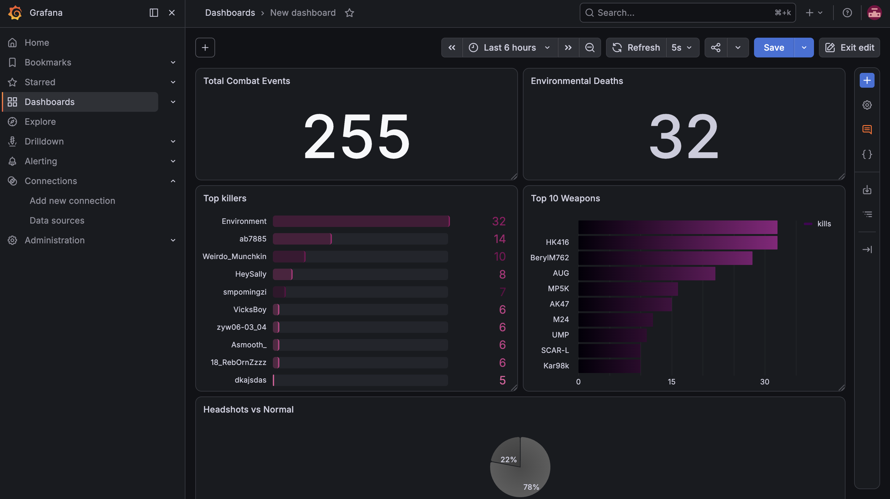
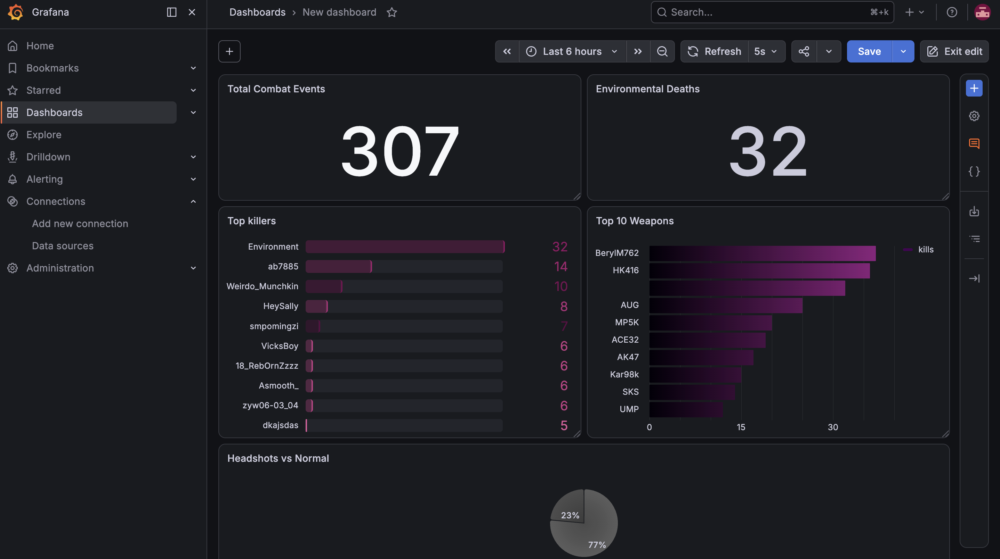

# Real-Time PUBG Analytics Pipeline

A real-time streaming analytics pipeline that ingests PUBG match telemetry from the official PUBG API, publishes combat events to Apache Kafka, processes them with Spark Structured Streaming, stores curated data in PostgreSQL, and visualizes live analytics with Grafana.

The producer replays telemetry from completed PUBG matches as an event stream, allowing the entire streaming pipeline to operate in real time.

---

## Architecture

```text
                    PUBG API
                       │
                       ▼
          Python Producer (Replay)
                       │
                       ▼
             Apache Kafka Topics
                       │
                       ▼
       Spark Structured Streaming
        • JSON Parsing
        • Validation
        • Cleansing
        • Watermarking
        • Deduplication
                       │
          ┌────────────┴────────────┐
          ▼                         ▼
     Clean Combat Events      Rejected Events
          │
          ▼
        PostgreSQL
          │
          ▼
   Grafana Live Dashboard
```

---

## Technologies

- Python
- Apache Kafka
- Apache Spark Structured Streaming
- PostgreSQL
- Grafana
- Docker Compose
- PUBG Developer API

---

# Features

- Replay real PUBG match telemetry as event streams
- Real-time event ingestion with Kafka
- Spark Structured Streaming processing
- Event-time watermarking
- Duplicate removal
- Schema validation
- Data cleansing
- Clean and rejected event pipelines
- PostgreSQL storage
- Live Grafana dashboard with automatic refresh
- Fully containerized environment using Docker Compose

---

# Project Structure

```text
pubg-streaming-platform/


│   
│
├── producer/
│   ├── api_client.py
│   ├── producer.py
│   └── schemas.py
│
├── spark/
│   └── combat_stream.py
│
├── scripts/
│   ├── create-topics.sh
│   └── run-spark.sh
│
├── docker-compose.yml
├── requirements.txt
├── requirements-spark.txt
└── .env.example
```

---

# Getting Started

## 1. Clone the repository


---

## 2. Create a virtual environment

```bash
python3 -m venv .venv

source .venv/bin/activate

pip install -r requirements.txt
```

---

## 3. Configure environment variables

```bash
cp .env.example .env
```

Edit `.env`

```env
KAFKA_BOOTSTRAP_SERVERS=localhost:9092

KAFKA_COMBAT_TOPIC=pubg.combat-events

PUBG_API_KEY=YOUR_API_KEY
PUBG_SHARD=steam

PUBG_REPLAY_SPEED=20

POSTGRES_URL=jdbc:postgresql://localhost:5433/pubg
POSTGRES_USER=pubg_user
POSTGRES_PASSWORD=pubg_password
```

`PUBG_REPLAY_SPEED`

Controls how quickly a completed PUBG match is replayed.

For example,

```text
20 seconds of gameplay
≈
1 second of real time
```

---

## 4. Start infrastructure

```bash
docker compose up -d
```

---

## 5. Create Kafka topics

```bash
chmod +x scripts/create-topics.sh

./scripts/create-topics.sh
```

---

## 6. Start Spark Structured Streaming

```bash
chmod +x scripts/run-spark.sh

./scripts/run-spark.sh
```

Spark continuously waits for new Kafka events and writes processed records into PostgreSQL.

---

## 7. Publish events

Open a new terminal.

```bash
python -m producer.producer
```

The producer downloads a completed PUBG match and replays its telemetry as a stream of Kafka events.

---

# Example Producer Output

```text
Delivered | partition=2 offset=347

Delivered | partition=2 offset=348

Delivered | partition=2 offset=349

Published 99 combat events to pubg.combat-events.
```

---

# Streaming Pipeline

Each replayed event flows through the following stages:

```text
PUBG Match Telemetry

        │

        ▼

Python Producer

        │

        ▼

Kafka Topic

        │

        ▼

Spark Structured Streaming

        │

        ▼

PostgreSQL

        │

        ▼

Grafana
```

---

# Data Processing

Spark Structured Streaming performs

- JSON parsing
- Schema validation
- Data cleansing
- Event-time watermarking
- Duplicate removal
- PostgreSQL writes

Rejected records can be written into a dedicated dead-letter table for further inspection.

---

# Live Dashboard

The Grafana dashboard refreshes automatically every **5 seconds**.

Current dashboard includes:

- Total Combat Events
- Top Weapons
- Top Killers
- Headshots vs Normal
- Environmental Deaths

---


## Live Dashboard



After Seconds: 



---

# Why replay instead of live gameplay?

The PUBG Developer API provides telemetry for completed matches rather than continuous live gameplay.

This project replays completed match telemetry as a stream of events, allowing the downstream pipeline (Kafka → Spark → PostgreSQL → Grafana) to behave exactly like a real-time streaming analytics system.

---


# License

MIT